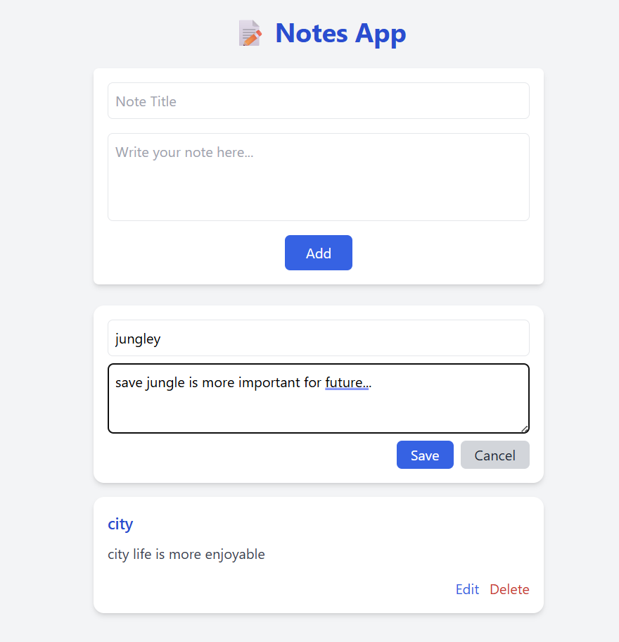
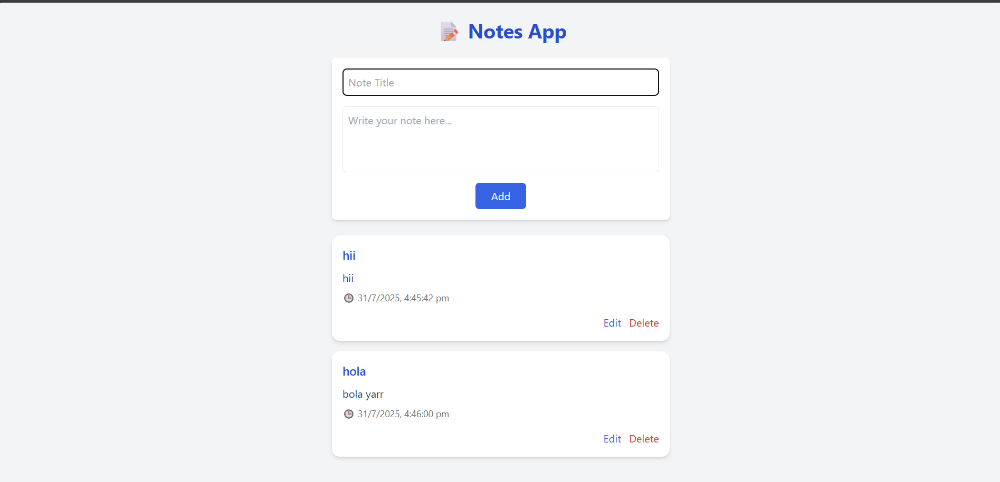

# 📝 Notes App (React + Redux Toolkit + Tailwind CSS)

A simple and elegant Notes App built with **React**, **Redux Toolkit**, and styled using **Tailwind CSS**. This app supports:

- ✅ Adding notes with title and content
- ✅ Editing notes inline (within the card)
- ✅ Deleting notes
- ✅ LocalStorage persistence
- ✅ Fully responsive design (Mobile & Desktop)

---

## 🚀 Features

- 📦 State Management using **Redux Toolkit**
- 💾 Data saved in **localStorage**
- 🖌️ Live **edit** within the card
- 🧹 Clean and modern UI using **Tailwind CSS**
- 📱 Fully **mobile responsive**
- ⚡ Built using **Vite** for fast development

---

## 📸 Screenshots

### 🖥️ Desktop View




---

### 📱 Mobile View



---

## 🛠️ Installation & Setup

### 1. Clone the repository

```bash
git clone https://github.com/dibesh7381/note-app
cd notes-app
npm install
npm run dev 
```

---

[Connect with me](https://github.com/dibesh7381)

---
